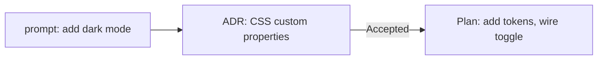

# A guide to working decision-trail-light

This is the human-facing tour: what the method is for, why it's shaped the
way it is, and how it feels to actually use it day to day. If you already
know all this and just want the mechanical steps for installing it in a
repo, that's [`adopting.md`](adopting.md). The terse reference an agent
reloads every session is [`template\AGENTS.md`](template/AGENTS.md).

## The problem it solves

A few weeks into any project you stop remembering *why*. Not what the code
does — that's readable — but why it's shaped that way instead of the three
other reasonable ways. Why this library and not that one. Why the retry
logic gives up after three attempts and not five. The reasoning lived in a
chat window, or a Slack thread, or someone's head, and now it's gone.

Then someone (maybe you, six months later; maybe an agent, thirty seconds
later) "fixes" the retry count back to five, because five looks more
correct and nothing on disk says otherwise.

decision-trail-light is a small habit that keeps that reasoning where the
code lives: a short, dated, append-only record of decisions and the plans
that carried them out, sitting next to the source in `docs\`.

## Why light

If you've seen the fuller `decision-trail` method this was distilled from,
you'll notice a lot is missing on purpose: no idea
stage before a decision, no per-PBI or per-feature folders, no `overview.md`
digest, no companion artifact folders, no tags. That's not an oversight —
it's the actual point of this variant.

The full method is built for a codebase with a sustained team and a backlog
system feeding it a stream of discrete work items; the folder-per-PBI
structure and the overview digest earn their cost there. Most projects
aren't that yet, or never will be. decision-trail-light keeps the two ideas
that pay for themselves almost immediately — write the decision down before
you act on it, write down what you actually did — and drops everything
whose cost only makes sense at larger scale. You can always graduate later
(see the note at the bottom of [`adopting.md`](adopting.md)); you don't pay
for it up front.

## The lifecycle: how a thought travels

Say you're adding a dark-mode toggle. Someone asks for it in a sentence.
That sentence is a **prompt** — worth keeping if it took real back-and-forth
to pin down, safe to skip if it's genuinely a one-liner. Either way, before
anything gets built, the actual decision gets written down as an **ADR**:
which approach (CSS custom properties vs. a theme-context object vs. a
class toggle), and — this is the part people skip and shouldn't — what you
*didn't* pick and why. "We didn't use a theme-context object because this
app has no other cross-cutting UI state and it would be the first" is a
sentence that saves someone a rediscovery later.

The ADR starts life with the heading `## Proposed decision` and status
`Proposed`. Once you (or whoever's judging it) actually agree with it, the
heading is renamed to `## Decision` and the status flips to `Accepted` — the
heading always tracks the status, so a reader scanning just the outline
knows where things stand without checking the frontmatter. If it's turned
down instead, it becomes `Rejected` and stays that way; rejected ideas are
kept, not deleted, because "we already tried that" is exactly the kind of
fact this whole method exists to preserve.

Once accepted, a **Plan** breaks the decision into the concrete steps taken
to build it — not a task tracker, just a short record of what was actually
done, so the ADR doesn't have to also describe the implementation.

That's the whole loop. Most sessions are just this, over and over: a
request comes in, an ADR captures the call, a Plan captures the work.

## When a decision needs to change

Software decisions aren't permanent, and the method doesn't pretend they
are. Three ways an ADR's story continues:

- **Amends** — you're refining the same decision, not reversing it (e.g.
  tightening the retry count from five to three). The original ADR gets an
  `Amended by:` note pointing at the new one; the new one gets `Amends:`
  pointing back. Status doesn't change — the original is still the accepted
  decision, just refined.
- **Supersedes** — you're replacing the decision outright (dark mode moves
  from CSS custom properties to a theme-context object after all, because a
  second cross-cutting concern showed up). The old ADR's status becomes
  `Superseded`, with `Superseded by:` pointing at the new one, which carries
  `Supersedes:` pointing back. Both stay on disk; the old one just isn't the
  live answer anymore.
- **Deprecated** — the decision no longer applies and nothing replaces it
  (the feature it supported got removed). Status becomes `Deprecated`, no
  paired link needed.

`Proposed`, `Rejected`, `Superseded`, and `Deprecated` are all terminal for
that document — once there, an ADR doesn't reopen. If the same question
comes back up, that's a new ADR that references the old one.

## The lighter escape hatch: correcting settled work

Sometimes you don't want a whole new ADR — you made a small, uncontroversial
factual slip (wrong file path, a typo in a decision that doesn't change its
meaning) and formally superseding it would be theater. That's what the
`decision-trail-correction` skill is for: a narrow, logged edit to something
already `Accepted`, used sparingly and only for corrections that don't
change what was actually decided. If there's any real judgment call
involved, that's an amendment or a new ADR instead, not a correction.

## The travel diary

Everything above is deliberate and gated — an ADR only gets written when a
real decision is being made, a Plan only when work is actually happening.
Sometimes you want something looser: a quick note about where you left off,
a thing you tried that didn't pan out and don't want to reinvestigate, a
"remember to look at X next." Nothing here rises to the level of a decision
worth an ADR, but it'd still be a shame to lose.

That's `docs\travel-diary.md` — a single running file, newest entry at the
top, no status, no lifecycle, no precondition to satisfy before writing.
Just ask, at any point, mid-work or not, and a dated entry gets prepended.
Try it — you'll love it. It's the lowest-friction habit in this whole
method, and often the one that ends up used the most.

## Finalizing a session

At a natural stopping point — a decision's been carried out, the loose ends
are tied off — the `finalize-session` skill writes a brief, informal closing
note and makes sure `ARCHITECTURE.md` still reflects reality. It only fires
when the ADRs and Plans touched in the session are actually settled
(nothing left `Proposed` or mid-Plan); if something's still open, it'll say
so instead of pretending to close the loop. Keeping `ARCHITECTURE.md`
current is the real point — the closing note is secondary.

## Working with an agent

**It's a conversation, not a command line.** You don't need to know the
skill names or invoke anything explicitly. Just talk about the work the way
you normally would — "let's add dark mode," "actually let's use a
theme-context object instead" — and the agent recognizes when a decision,
plan, correction, or diary entry is warranted and reaches for the right
skill on its own. The skills exist so the agent behaves consistently, not so
you have a new syntax to learn.

**A "yes" has a scope.** When an agent proposes a decision and you say
"yes," you're agreeing to *that* ADR — the approach and the stated
trade-offs — not signing a blank check for whatever gets built afterward.
It's entirely normal, and expected, to look at the resulting Plan and say
"wait, that's not what I meant," and have it corrected or superseded. The
paper trail exists precisely so disagreements like that are cheap to have
and cheap to resolve.

**Resuming is cheap.** Coming back to a project after a break — or handing
it to a different agent entirely — doesn't require re-explaining anything.
`AGENTS.md` says how the project works; `ARCHITECTURE.md` says what exists;
the ADRs say why it's shaped that way; the travel diary says where things
were left. A new session can read those four things and be caught up in
minutes, not by asking you to remember.

## How to start

If you're setting this up in a new or existing repo, the mechanical
steps — which files go where, how to handle a repo that already has some of
them — are in [`adopting.md`](adopting.md). Point your agent at this repo
and that file, and it can do the copying itself.

## Where to go next

- [`template\AGENTS.md`](template/AGENTS.md) — the terse method reference
  that lives in every adopting repo.
- [`template\.github\skills\`](template/.github/skills/) — the five skills
  themselves, if you want to read exactly what each one does.
- [`adopting.md`](adopting.md) — installing this in a repo, step by step.
